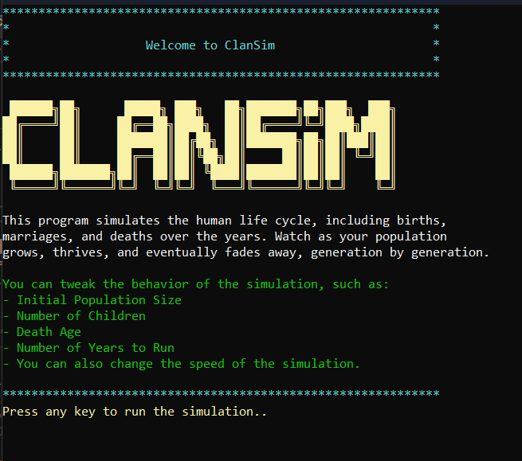
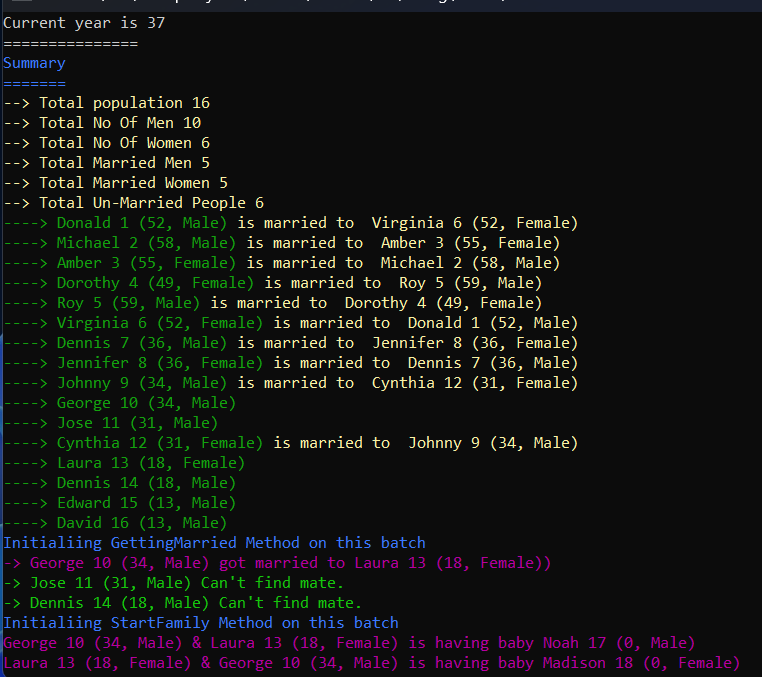
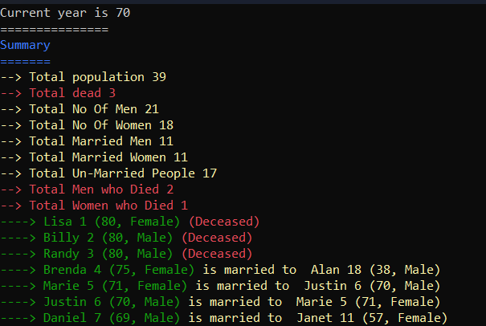

# ClanSim

## Introduction

**ClanSim** is a simple, single-page console application written in C# that simulates a clan of people over time. As each year passes, you can observe the population grow. Individuals will age, marry, have children, remarry if their spouse dies, and eventually die—all while their generations live alongside them. You can also adjust the speed of the simulation.

## Installation

1. **Clone the Project**:
   - Clone the repository and run it using .NET 8.0.

2. **Or Run Directly**:
   - You can simply copy and paste `Program.cs` and run it—no dependencies required as of 08/27/2024.

## Features

- **Dynamic Population**: Watch your clan as people are born, grow old, have children, and eventually die.
- **Yearly Simulation**: The application runs in a loop where each iteration represents one year.
- **Remarriage**: People can remarry if their spouse dies.
- **Customizable Settings**:
  - **Life Span**: Adjust how long people live (`_DEATH_AGE`).
  - **Number of Children**: Set the number of children per couple (`_NO_OF_CHILDREN`).
  - **Marriage Age**: Define the marriage age (`_MARRAGE_AGE`).
  - **Fertility Window**: Set the fertility age range (`_FERTILITY_BEGIN_AGE`, `_FERTILITY_END_AGE`).
  - **Initial Population**: Determine the initial size of the clan (`INITIAL_POPULATION_SIZE`).
  - **Simulation Duration**: Set the number of years the simulation will run (`NO_OF_YEARS`).
  - **Simulation Speed**: Control the speed of the simulation (`PAUSE_BETWEEN_EACH_YEAR`).

## Screenshots

**Here are some screenshots of ClanSim in action:**

Below, you can see the simulation at year 37. The application displays a yearly summary with details like current population, number of men and women, and the count of unmarried people. Below that, in green, you can see individual profiles, showing names, ages, genders, and who they are married to. 

After the summary, the `GettingMarried()` method is called to handle matchmaking. Then, the `StartFamily()` method is executed, where you can observe couples having children.

In the next screenshot, the year is 70. At this stage, people start to pass away as the life cycle continues.

